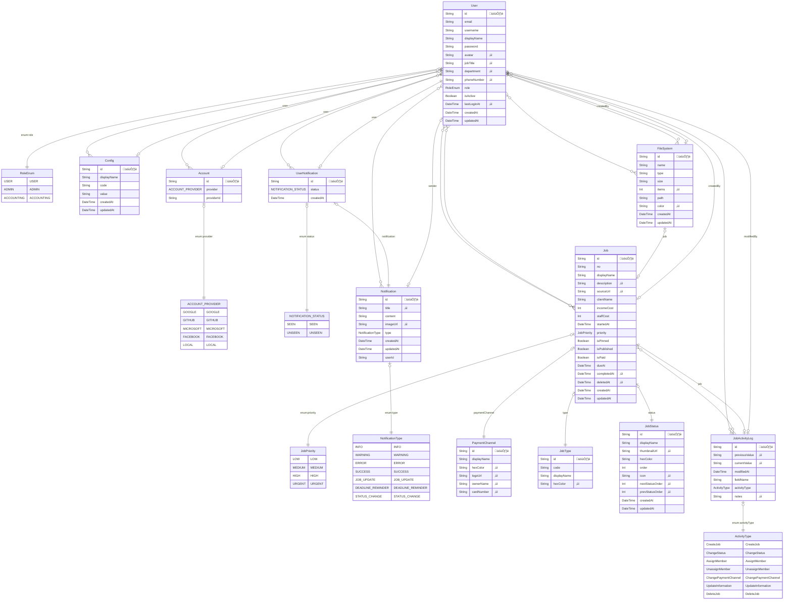

```mermaid
erDiagram

        RoleEnum {
            USER USER
ADMIN ADMIN
ACCOUNTING ACCOUNTING
        }
    


        ACCOUNT_PROVIDER {
            GOOGLE GOOGLE
GITHUB GITHUB
MICROSOFT MICROSOFT
FACEBOOK FACEBOOK
LOCAL LOCAL
        }
    


        JobPriority {
            LOW LOW
MEDIUM MEDIUM
HIGH HIGH
URGENT URGENT
        }
    


        ActivityType {
            CreateJob CreateJob
ChangeStatus ChangeStatus
AssignMember AssignMember
UnassignMember UnassignMember
ChangePaymentChannel ChangePaymentChannel
UpdateInformation UpdateInformation
DeleteJob DeleteJob
        }
    


        NOTIFICATION_STATUS {
            SEEN SEEN
UNSEEN UNSEEN
        }
    


        NotificationType {
            INFO INFO
WARNING WARNING
ERROR ERROR
SUCCESS SUCCESS
JOB_UPDATE JOB_UPDATE
DEADLINE_REMINDER DEADLINE_REMINDER
STATUS_CHANGE STATUS_CHANGE
        }
    
  "User" {
    String id "🗝️"
    String email 
    String username 
    String displayName 
    String password 
    String avatar "‚ùì"
    String jobTitle "‚ùì"
    String department "‚ùì"
    String phoneNumber "‚ùì"
    RoleEnum role 
    Boolean isActive 
    DateTime lastLoginAt "‚ùì"
    DateTime createdAt 
    DateTime updatedAt 
    }
  

  "Config" {
    String id "🗝️"
    String displayName 
    String code 
    String value 
    DateTime createdAt 
    DateTime updatedAt 
    }
  

  "Account" {
    String id "🗝️"
    ACCOUNT_PROVIDER provider 
    String providerId 
    }
  

  "FileSystem" {
    String id "🗝️"
    String name 
    String type 
    String size 
    Int items "‚ùì"
    String path 
    String color "‚ùì"
    DateTime createdAt 
    DateTime updatedAt 
    }
  

  "Job" {
    String id "🗝️"
    String no 
    String displayName 
    String description "‚ùì"
    String sourceUrl "‚ùì"
    String clientName 
    Int incomeCost 
    Int staffCost 
    DateTime startedAt 
    JobPriority priority 
    Boolean isPinned 
    Boolean isPublished 
    Boolean isPaid 
    DateTime dueAt 
    DateTime completedAt "‚ùì"
    DateTime deletedAt "‚ùì"
    DateTime createdAt 
    DateTime updatedAt 
    }
  

  "PaymentChannel" {
    String id "🗝️"
    String displayName 
    String hexColor "‚ùì"
    String logoUrl "‚ùì"
    String ownerName "‚ùì"
    String cardNumber "‚ùì"
    }
  

  "JobType" {
    String id "🗝️"
    String code 
    String displayName 
    String hexColor "‚ùì"
    }
  

  "JobStatus" {
    String id "🗝️"
    String displayName 
    String thumbnailUrl "‚ùì"
    String hexColor 
    Int order 
    String icon "‚ùì"
    Int nextStatusOrder "‚ùì"
    Int prevStatusOrder "‚ùì"
    DateTime createdAt 
    DateTime updatedAt 
    }
  

  "JobActivityLog" {
    String id "🗝️"
    String previousValue "‚ùì"
    String currentValue "‚ùì"
    DateTime modifiedAt 
    String fieldName 
    ActivityType activityType 
    String notes "‚ùì"
    }
  

  "UserNotification" {
    String id "🗝️"
    NOTIFICATION_STATUS status 
    DateTime createdAt 
    }
  

  "Notification" {
    String id "🗝️"
    String title "‚ùì"
    String content 
    String imageUrl "‚ùì"
    NotificationType type 
    DateTime createdAt 
    DateTime updatedAt 
    String userId 
    }
  
    "User" o|--|| "RoleEnum" : "enum:role"
    "User" o{--}o "UserNotification" : ""
    "User" o{--}o "Job" : ""
    "User" o{--}o "Job" : ""
    "User" o{--}o "FileSystem" : ""
    "User" o{--}o "FileSystem" : ""
    "User" o{--}o "Account" : ""
    "User" o{--}o "Notification" : ""
    "User" o{--}o "JobActivityLog" : ""
    "User" o{--}o "Config" : ""
    "Config" o|--|o "User" : "user"
    "Account" o|--|| "ACCOUNT_PROVIDER" : "enum:provider"
    "Account" o|--|| "User" : "user"
    "FileSystem" o|--|| "User" : "createdBy"
    "FileSystem" o|--|o "Job" : "job"
    "Job" o|--|| "JobType" : "type"
    "Job" o|--|| "User" : "createdBy"
    "Job" o|--|| "PaymentChannel" : "paymentChannel"
    "Job" o|--|| "JobStatus" : "status"
    "Job" o{--}o "JobActivityLog" : ""
    "Job" o|--|| "JobPriority" : "enum:priority"
    "JobActivityLog" o|--|| "Job" : "job"
    "JobActivityLog" o|--|| "User" : "modifiedBy"
    "JobActivityLog" o|--|| "ActivityType" : "enum:activityType"
    "UserNotification" o|--|| "User" : "user"
    "UserNotification" o|--|| "Notification" : "notification"
    "UserNotification" o|--|| "NOTIFICATION_STATUS" : "enum:status"
    "Notification" o|--|o "User" : "sender"
    "Notification" o|--|| "NotificationType" : "enum:type"
```
